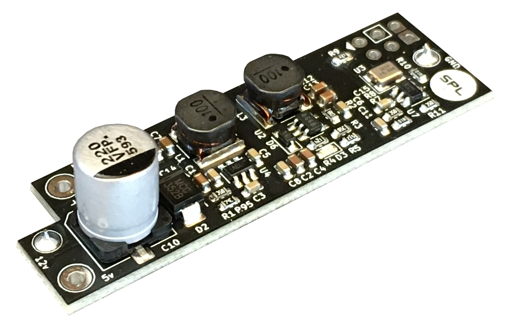

# DC-64 <!-- omit in toc -->
DC-64a and DC-64d are two similar mod-kits allowing to power the Commodore-64 microcomputer with a modern switching 12V-DC power supply. Both boards feature an oscillator on board to produce the 50-60Hz Time-of-Day (TOD) clock, which would normally be extracted from the original 9V-AC power supply.

The two versions share the power supply section of the circuit and only differ in how the TOD clock is generated.
- DC-64a features a 555-like RC oscillator that can be manually calibrated with a trimmer.
- DC-64d features a high-precision crystal oscillator driving a small microcontroller that acts as a clock divider. This board does not require calibration.

If you would like to get in touch with the developer, please join the SPL [Discord](https://discord.gg/gJsCgebkDw) server.

DC-64 can be purchased pre-assembled or as a DIY-Kit from these authorized shops:

- [Retro-Updates](https://www.retro-updates.com/product/14007423/dc-64d-the-complete-dc-power-mod-for-the-c64)
- [Restore-Store](https://restore-store.de/home/680-dc-64d-v02.html)

Sales of DC-64 by any shop other than the ones mentioned above may be in violation of the [license](#2-license) terms and conditions and and be reported to the developer

# Table of Contents <!-- omit in toc -->

* [1. Compatibility, Installation \& Precautions](#1-compatibility-installation--precautions)
* [2. License](#2-license)
* [3. Disclaimer](#3-disclaimer)

<figure align="center">
	
	<figcaption>DC-64 v0.2</figcaption>
</figure>

# 1. Compatibility, Installation & Precautions
The [instruction manual](doc/DC-64x_v0_manual.pdf) on how to install and operate the board is available in PDF format alongside the fabrication data. Users shall read these instructions carefully and fully understand the circuit's limitations before installing and/or using it. Incorrect installation of the board supply or failure to comply with the recommended operating conditions may result in damage to the board and/or to the computer, with risk of overheating, fire and/or explosion.

# 2. License
License information is included on top of all software source files as well as in all schematics. Files that do not contain explicit licensing information are subject to the licensing terms stated in the LICENSE.txt provided in the main project folder:

Unless stated otherwise in individual files, all hardware design Schematics, Bill of Materials, Gerber files and manuals are licensed under Creative Commons Attribution-NonCommercial-ShareAlike 4.0 International. To view a copy of this license, visit http://creativecommons.org/licenses/by-nc-sa/4.0/

Unless otherwise stated in individual files, all software source files are Licensed under the Apache License, Version 2.0. You may obtain a copy of this license at http://www.apache.org/licenses/LICENSE-2.0

# 3. Disclaimer
All material is provided on an 'AS IS' BASIS, WITHOUT WARRANTIES OR CONDITIONS OF ANY KIND in accordance to the license deed applicable to
each individual file.
